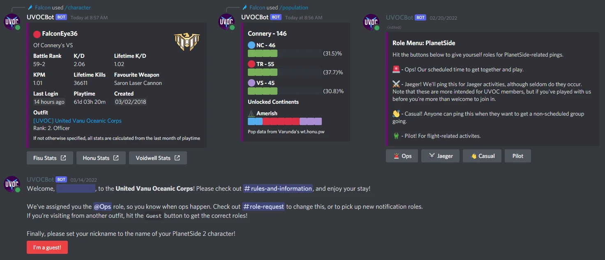

# UVOCBot


Provides various functions to assist with the experience of the UVOC outfit Discord server. Current features include:

- PlanetSide 2 Queries:
    - Server population and continent status.
    - Basic character stats.
    - Online outfit members.
    - Online friends.
    - Outfit base capture tracking, including members involved in any captures.
- Tweet relaying - posts tweets from PlanetSide 2 developers into a channel.
- Role menus.
- Bulk voice channel movement - never drag people one-at-a-time again!
- Welcome messages - assign default roles, let users pick an alternate role set, and make guesses at their in-game name for easy nickname changes.
- Bulk reaction-based role assignment.
- Random team generation.
- Various other features, such as coinflips, timestamp generation and basic admin logs.



To my knowledge, there isn't a publicly hosted instance of UVOCBot available. Hence if you'd like to use it in your own server, you'll have to host your own, or find someone kind enough to do it for you. See [Setup](#Setup) for more info.

Contrary to the above, if you know me through the PlanetSide 2 community, feel free to get in touch and ask for a private invite link. I might say yes :slightly_smiling_face:.

# Setup for Hosting

Before continuing, you should note that UVOCBot is designed with a Linux host in mind; it has support for systemd and I only provide Linux binaries. If you'd like support for running as a Windows service and the corresponding binaries, please open an Issue.

1. Create a new application in the Discord Developer portal - https://discord.com/developers/applications. Give it a name and icon and **add a bot** to the application.

    1. :warning: Ensure that you enable the `Presence Intent` and `Server Members Intent`, found under the Bot tab of your application.

2. Head on over to the wiki page [Hosting on Linux](https://github.com/carlst99/UVOCBot/wiki/Hosting-on-Linux) and follow the instructions there.

3. Invite the bot to your server using [https://discord.com/api/oauth2/authorize?client_id=<YOUR_CLIENT_ID>&permissions=2570144848&scope=bot%20applications.commands](https://discord.com/api/oauth2/authorize?client_id=<YOUR_CLIENT_ID>&permissions=2570144848&scope=bot%20applications.commands).

# Building and Developing

1. Install the [.NET 6 SDK](https://dotnet.microsoft.com/download/dotnet/6.0).
2. Install [MariaDB](https://mariadb.org/) and create a database. The name is up to you.
3. Modify the requisite `appsettings.json` files to include your API keys and database connection string
4. Update the database to the latest migration. If you are using the .NET Core CLI, run the command:
    ```sh
    # dotnet CLI
    dotnet ef database update
    # Visual Studio Package Manager
    Update-Database
    ```

### Project Structure

UVOCBot is composed of multiple components
- `UVOCBot.Core`: A library containing the database models.
- `UVOCBot.Discord.Core`: A library containing shared Discord components.
- `UVOCBot`: The bot itself. A console app making use of the Generic Host that drives the connection to the Discord API and registers plugins.
- Plugins. Class libraries used to help separate the logic within the bot.

# Acknowledgements

UVOCBot is built on these amazing libraries:

- [DbgCensus](https://github.com/carlst99/DbgCensus)
- [Entity Framework Core](https://docs.microsoft.com/en-us/ef/core/)
- [FuzzySharp](https://github.com/JakeBayer/FuzzySharp)
- [Pomelo.EntityFrameworkCore.MySql](https://github.com/PomeloFoundation/Pomelo.EntityFrameworkCore.MySql)
- [Remora.Discord](https://github.com/Nihlus/Remora.Discord)
- [Serilog](https://github.com/serilog/serilog)
- [Tweetinvi](https://github.com/linvi/tweetinvi)
